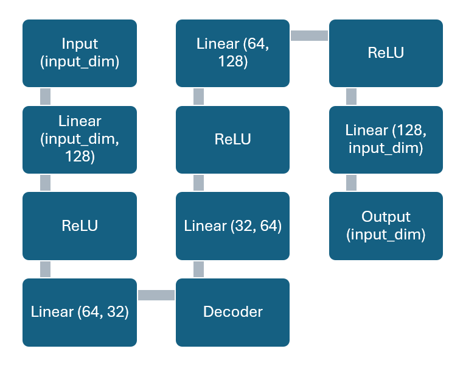
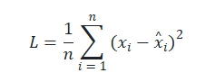
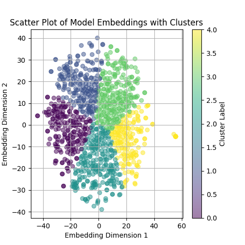
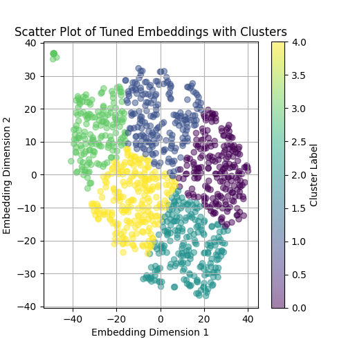
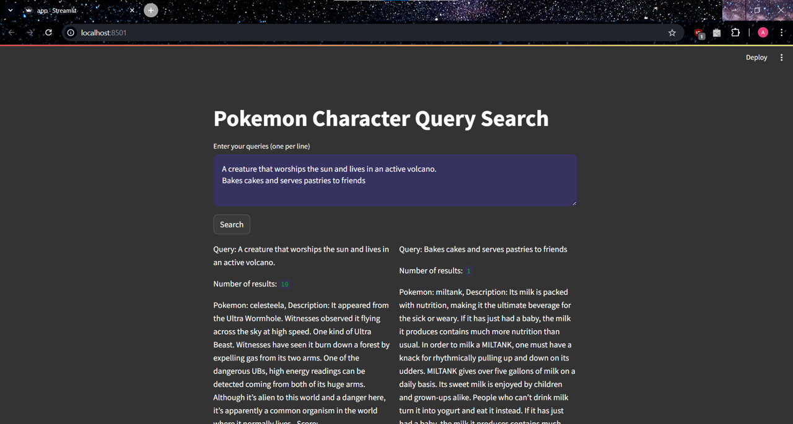

# DL4.1. APS2 - Vector-Based Search

Student: Ana Carolina Souza

## Step 1 - Find Embeddings

### Dataset

The dataset used was obtained through webscraping, using Requests and Beautiful Soup, from the website [Pokémon Database](https://pokemondb.net/). The scrapper used to get the data is available in the `scrapper` folder, as well as the resulting dataset `compiled_pokemon.parquet` in the `output` folder. The dataset contains the name of the pokémon and a description that contains all of the pokédex entries compiled into a single text. The dataset has 1025 lines, one for each pokémon released so far.

### Generating Embeddings

The embeddings were generated using SBERT (Sentence-BERT), which is a modification of the BERT network that is trained to generate embeddings for sentences. The SBERT model used was the `all-MiniLM-L6-v2` model, which is a generic model for generating embeddings for sentences. The model was fine-tuned on the dataset using the `sentence-transformers` library. In order to fine-tune, the following neural network topology was used:



### Training Process

The autoencoder was trained using the Adam optimizer with a learning rate of 0.001 and 50 epochs. The loss function used was the Mean Squared Error (MSE), which is a common loss function used in autoencoders. The MSE loss function was chosen because it is a good loss function for regression problems due to minimizing the losses in reconstruction. This minimization is important to ensure that the meaning of the sentences will be preserved in the long run, which is crucial for the similarity search to make sense. The MSE loss function is defined as:



## Step 2: Visualize Your Embeddings

The embeddings were visualized using t-SNE (t-distributed Stochastic Neighbor Embedding), which is a technique used to visualize high-dimensional data in a lower-dimensional space. The t-SNE plot shows the embeddings of the pokémon descriptions in a 2D space, where similar pokémon are closer together. 5 clusters were identified in the t-SNE plot using k-means, which are represented by different colors. The clusters are not very well defined, but it is possible to see some groups of pokémon that are similar to each other.


Pre-tuned embeddings


Post-tuned embeddings

Both plots show similar structures, but the post-tuned embeddings are more defined and more spread out. Despite this, the clusters are still not very well defined, which may be due to the overlap and variety of the descriptions of the pokémon.

Original clusters:

- Cluster 0 (Purple): This cluster contains mainly bug and poison type pokémon, such as Caterpie, Cutiefly and Weedle. It also includes pokémon that mention toxins and powders.

- Cluster 1 (Blue): This cluster contains mainly grass pokémon, like Bulbasaur and evolutions. It mentions mainly plants, sunlight and growth.

- Cluster 2 (Teal): This cluster contains mainly water pokémon, like Squirtle and evolutions. It mentions mainly water, oceans and shells. It also includes pokemon that have hard skin or shells, like Metapod.

- Cluster 3 (Green): This cluster contains mainly smart, long living and enchanting pokémon, like Ninetales. It mentions mainly intelligence, mythological creatures and deities or lengends.

- Cluster 4 (Yellow): This cluster contains mainly electric pokémon, like Pikachu and evolutions. It mentions mainly electricity, storms and energy.

The tuned clusters appear to have the same theming as the original ones, but their order is different. This makes sense cause the shape of the clusters is fairly similar, but the distance between the points is different.

## Step 3: Test the Search System

The search system was tested by encoding a query and returning the most similar pokémon. It uses the cosine similarity to calculate the similarity between the query and the pokémon descriptions. The same queries as the first APS weren't able to be reused exactly due to their vagueness. They were reconstructed with longer sentences to preserve the meaning, but give better context to the engine. The following queries were tested:

- Returns 10 results: "A creature that worships the sun and lives in an active volcano. It likes fire and arson."
- Returns less than 10 results: "Psychic powers to destroy the world"
- Returns something not obvious: "Bakes cakes and serves pastries to friends"

The results are present in `outputs/results.json`.

It's important to note that each time you run the search system, the results may change due to the tuning of the embeddings, which are changed slightly each time the model is trained. This means that the similarity between the queries and the pokémon descriptions may vary for each run.

## Step 4: MLOPs Specialist

In order to deploy the code, Streamlit and MLFlow were used. Streamlit was chosen for the deploy as it is free and easy to use. The source code for the deploy is `app.py`and the link can be found [here](https://pkmncards-scrapper.streamlit.app/). It's a simple interface where the user can input a list of queries and get the most similar pokémon to the queries. The deploy uses the same model and code as the local version, but it is hosted on Streamlit's servers. The queries are encoded using the model and the most similar pokémon are returned to the user. In order to speed up the deploy, the loading of the model and embedding is cached using Streamlit's caching feature. This way, the model and embeddings are only loaded once and are reused for each query. This means that the results will remain consistent for each query, but may change if the model is updated.

MLFlow was used to track the experiments and the model. The model was saved in the `mlruns` folder and the experiments were tracked using MLFlow. This permits the user to see the results of the experiments and the model that was used in the deploy and to easily change the model if needed without disrupting the deploy. In order to update the model, simply train it locally using `main.py`. The new model will be saved by MLFlow and be automatically used when commited to this repository and branch. Currently, the deploy uses the most recent model and tuned embeddings from the Default (0) experiment.



## How to Run the Code

Install the necessary dependencies by running the following command inside the `root` folder:

```bash
pip install -r requirements.txt
```

To generate the embeddings and test the model, run the following command in the root directory of the project:

```bash
python main.py
```

### How to run the deploy locally

To run the deploy locally, run the following command in the root directory of the project:

```bash
streamlit run app.py
```

### How to use the scrapper

The scrapper is a simple script that uses Requests and Beautiful Soup to get the pokédex entries from the Pokémon Database website. To use the scrapper, you need to have Python installed on your machine.
Install the necessary dependencies by running the following command inside the `scrapper` folder:

```bash
pip install -r requirements.txt
```

You can run the scrapper by running the following command in the root directory of the project:

```bash
python scrapper/main.py
```

## References

- [MLFlow Documentation](https://www.mlflow.org/docs/latest/index.html)
- [Streamlit Documentation](https://docs.streamlit.io/en/stable/)
- [Sentence Transformers Documentation](https://www.sbert.net/docs/)
- [SBert](https://arxiv.org/abs/1908.10084)
